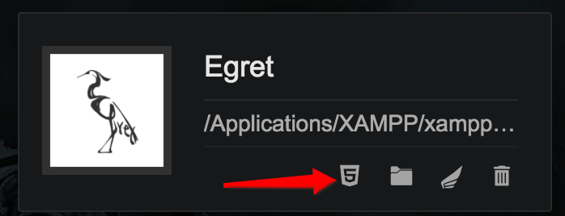
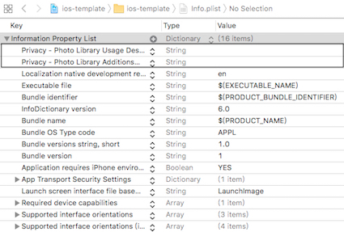

# 项目发布设置使用说明

---

此文档旨在帮助用户顺利的完成项目打包发布，解决发布过程中可能遇到的问题，并最终完成发布工程的个性化配置和功能接入，文档分为以下几个部分：

> * 发布设置前的准备工作
> * 项目发布配置
> * 发布工程的个性化配置
> * JS和原生的通信接入
> * 运行时error事件和state事件处理方法
> * 添加loading界面

---

## 发布设置前的准备工作

- 安装最新版本的launcher
- 确认引擎版本
    - 下载的引擎版本必须为***5.1.6及以上***
    - 在launcher中的引擎页选择下载
- 安装Xcode
    - 建议版本: 8.3或以上
    - 后续需要在Xcode中完成发布项目的修改和功能接入  
    
---

## 项目发布配置

### 1. 创建项目

- launcher项目页中，点击创建项目，填入项目名称，并选择引擎版本为5.1.6（或以上），点击创建按钮。

>此文档不涉及具体项目功能，可以关闭 Egret Wing窗口。

### 2. 发布配置

- 在launcher的项目页中找到新创建的项目，点击该项目下的发布设置按钮。

- 点击左侧的iOS按钮，然后在右侧页面中，输入应用名称，填写新的应用包名，点击确定。
- 新弹出的窗口中选择点击***打开文件夹***按钮。

---

## 发布工程的个性化配置

- 解决国行手机首次启动需要请求网络权限的问题
    - 模版中通过[_native setNetworkStatusChangeCallback:]监听网络状态，有网络连接时才启动游戏。

- 访问相册权限的问题
    - 为了支持保存截图到本地的功能，模版中默认注册了访问相册的权限，如不需要可以从info.plist中删除。
    - 模版中默认加入的权限并无对应的文字，若要发布至AppStore中，必须在权限后添加任意提醒用户的文字才能通过审核，如“允许Egret Native访问您的相册？”

    
    > - Privacy - Photo Library Usage Description是IOS11.0版本之前的相册读写权限 
    > - Privacy - Photo Library Additions Usage Description是IOS11.0版本之后的相册写权限，读权限系统已经默认开放
    
    - 没加文字之前与添加文字之后
    
                                    
     

- 个性化设置
    - 修改游戏地址：将函数`[native startGame:]`的参数替换为当前游戏的地址。

    >需要注意，如果工程的assets目录下存在game文件，那么此处填写的游戏必须和game文件中的游戏保持一致，否则会出现问题。
    
    - 控制FPS面板的显示：修改`_native.config.showFPS = true/false;`。true为显示，false为隐藏。
    - 控制log在屏幕上的显示时间：修改`_native.config.fpsLogTime = 30;`，改为`-1`时是永久显示。
    - 是否禁用核心渲染驱动：修改`_native.config.disableNativeRender = false/true`。false为启用核心渲染驱动，true为禁用核心渲染驱动。
    - 是否清理缓存：修改`_native.config.clearCache = false/true;`。false为不自动清理缓存，true为自动清理缓存。
    - 控制页面超时时间：修改`_native.config.loadingTimeout = 0;`。单位为秒，0为不设置超时。
    
---

## JS和原生的通信接入

### 1. 原生部分
- 在AppDelegate.mm的`setExternalInterfaces`方法里配置通信接口
    - `[_native setExternalInterface: Callback:]` 注册JS中可以调用的原生函数
    - `[_native callExternalInterface: Value:]`调用JS函数
- `setExternalInterface`方法的第一个参数是JS中调用原生函数的函数名，第二个参数是该原生函数的功能实现
- `callExternalInterface`方法的第一个参数是JS函数的函数名，第二个传入的参数

```objective-c
- (void)setExternalInterfaces {
    __block EgretNativeIOS* support = _native;
    [_native setExternalInterface:@"sendToNative" Callback:^(NSString* message) {
        NSString* str = @"Native get message: ";
        str = [str stringByAppendingString:message];
        NSLog(@"%@", str);
        [support callExternalInterface:@"sendToJS" Value:str];
    }];
}
```

### 2. JS部分

- `egret.ExternalInterface.call`调用注册过的原生函数

```js
egret.ExternalInterface.call("sendToNative", "message from JS");
```

- `egret.ExternalInterface.addCallback`注册原生中可以调用的JS函数

```js
function sendToJS(msg) {
    console.log(msg);
}
egret.ExternalInterface.addCallback("sendToJS", sendToJS);
```

> 只有通过`setExternalInterface`注册的原生函数，才能在JS中通过`call`调用。
> 只有通过`addCallback`注册的JS函数，才能在原生中通过`callExternalInterface`调用。

---

## 运行时error事件和state事件处理方法

### 1. runtime运行中各个事件的说明
- 事件说明如下

| 流程 | 事件消息 | 事件类型 | 事件意义 |
| :- | :-------- | :--------: | :-------- |
| index加载 | {"error":"load"} | onError | index加载失败 |
| | {"state”:”starting”} | onState | index加载成功 |
| js加载 | {"error":"start"} | onError | js加载失败 |
| | {"state”:”running”} | onState | js加载成功 |
| js运行中 | {"error”:”stopRunning”} | onError   | js崩溃 |


### 2. 监听error事件和state事件的方法

- 首先声明事件关键字符串

```objective-c
const static NSString* appError = @"error";
// 加载首页失败
const static NSString* errorIndexLoadFailed = @"load";
// 启动引擎失败 
const static NSString* errorJSLoadFailed = @"start";
// 引擎停止运行
const static NSString* errorJSCorrupted = @"stopRunning";
const static NSString* appState = @"state";
// 正在启动引擎
const static NSString* stateEngineStarted = @"starting";
// 引擎正在运行
const static NSString* stateEngineRunning = @"running";
```

- 注册对error事件的监听，在函数`setExternalInterfaces`中：

```objective-c
- (void)setExternalInterfaces {
    __block EgretNativeIOS* support = _native;
    __block AppDelegate* thiz = self;
    
    [_native setExternalInterface:@"@onError" Callback:^(NSString* message) {
        NSString* str = @"Native get onError message: ";
        
        NSData* jsonData = [message dataUsingEncoding:NSUTF8StringEncoding];
        NSError* err;
        NSDictionary* dic = [NSJSONSerialization JSONObjectWithData:jsonData
                                                            options:NSJSONReadingMutableContainers
                                                              error:&err];
        if (err) {
            NSLog(@"onError message failed to analyze");
            return;
        }
        
        NSString* error = [dic objectForKey:appError];
        [thiz handleErrorEvent:error];
        
        str = [str stringByAppendingString:error];
        NSLog(@"%@", str);
    }];
}
```

- 注册对state事件的监听，在函数`setExternalInterfaces`中：

```objective-c
- (void)setExternalInterfaces {
    __block EgretNativeIOS* support = _native;
    __block AppDelegate* thiz = self;
    
    [_native setExternalInterface:@"@onState" Callback:^(NSString* message) {
        NSString* str = @"Native get onState message: ";
        
        NSData* jsonData = [message dataUsingEncoding:NSUTF8StringEncoding];
        NSError* err;
        NSDictionary* dic = [NSJSONSerialization JSONObjectWithData:jsonData
                                                            options:NSJSONReadingMutableContainers
                                                              error:&err];
        if (err) {
            NSLog(@"onState message failed to analyze");
            return;
        }
        
        NSString* state = [dic objectForKey:appState];
        [thiz handleStateEvent:state];
        
        str = [str stringByAppendingString:state];
        NSLog(@"%@", str);
    }];
}
```

### 3. 处理具体事件

- 处理具体error事件

```objective-c
// according to the error msg, do different action
- (void)handleErrorEvent:(NSString*)error {
    if ([errorIndexLoadFailed isEqualToString:error]) {
        NSLog(@"errorIndexLoadFailed");
    } else if ([errorJSLoadFailed isEqualToString:error]) {
        NSLog(@"errorJSLoadFailed");
    } else if ([errorJSCorrupted isEqualToString:error]) {
        NSLog(@"errorJSCorrupted");
    }
}
```

- 处理具体state事件

```objective-c
// according to the state msg, do different action
- (void)handleStateEvent:(NSString*)state {
    if ([stateEngineStarted isEqualToString:state]) {
        NSLog(@"stateEngineStarted");
    } else if ([stateEngineRunning isEqualToString:state]) {
        NSLog(@"stateEngineRunning");
    }
}
```

---

## 添加loading界面

>loading界面的使用依赖与state事件的处理，请先完成上一部分的阅读。

### 1. 打开loading界面

- 在AppDelegate的didFinishLaunchingWithOptions函数中调用函数showLoadingView

```objective-c
@implementation AppDelegate {
    UIViewController* _viewController;
    UIImageView* _imageView;
}

- (BOOL)application:(UIApplication *)application didFinishLaunchingWithOptions:(NSDictionary *)launchOptions {
    // Override point for customization after application launch.
    NSString* gameUrl = @"http://tool.egret-labs.org/Weiduan/game/index.html";
    
    _native = [[EgretNativeIOS alloc] init];
    _native.config.showFPS = true;
    _native.config.fpsLogTime = 30;
    _native.config.disableNativeRender = false;
    _native.config.clearCache = false;
    
    _viewController = [[ViewController alloc] initWithEAGLView:[_native createEAGLView]];
    if (![_native initWithViewController:_viewController]) {
        return false;
    }
    [self setExternalInterfaces];
    
    NSString* networkState = [_native getNetworkState];
    if ([networkState isEqualToString:@"NotReachable"]) {
        __block EgretNativeIOS* native = _native;
        [_native setNetworkStatusChangeCallback:^(NSString* state) {
            if (![state isEqualToString:@"NotReachable"]) {
                dispatch_async(dispatch_get_main_queue(), ^{
                    [native startGame:gameUrl];
                });
            }
        }];
        return true;
    }
    
    [_native startGame:gameUrl];
    
    [self showLoadingView];
    
    return true;
}
    
- (void)showLoadingView {
    _imageView = [[UIImageView alloc] initWithFrame:_viewController.view.frame];
    [_imageView setImage:[UIImage imageNamed:@"icon"]];
    [_viewController.view addSubview:_imageView];
    [_viewController.view bringSubviewToFront:_imageView];
}
```

### 2. 关闭loading界面

- 收到{"state”:”running”}消息后，调用函数hideLoadingView

```objective-c
- (void)hideLoadingView {
    [_imageView removeFromSuperview];
}
```
